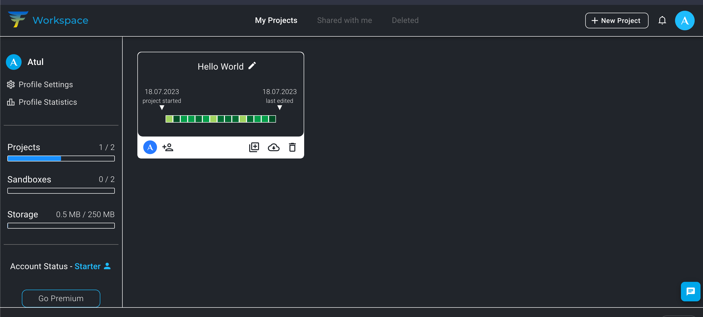

# helloworld

A new Flutter project.

## Getting Started

This project is a starting point for a Flutter application.

## [FlutLab](https://flutlab.io/) 

Create a account on Flutlab By clicking [here](https://flutlab.io/) 

## Creating Your project
Once loggedIn you will see the below interface

Under My Projects Select Your will Find Hello World project Already Created. Open that project and You Will see the below interface. 

Now if you click on top Left marked icon to run the emulator and congratulations you ran your first flutter app

